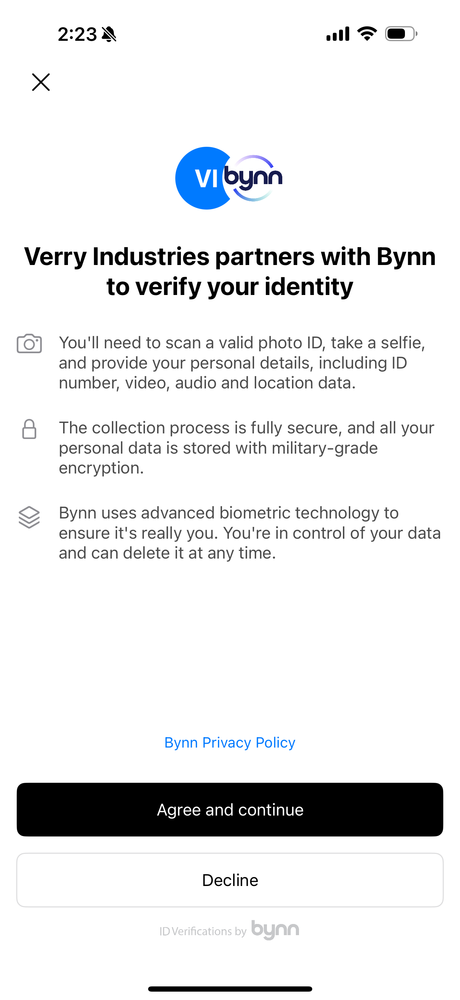
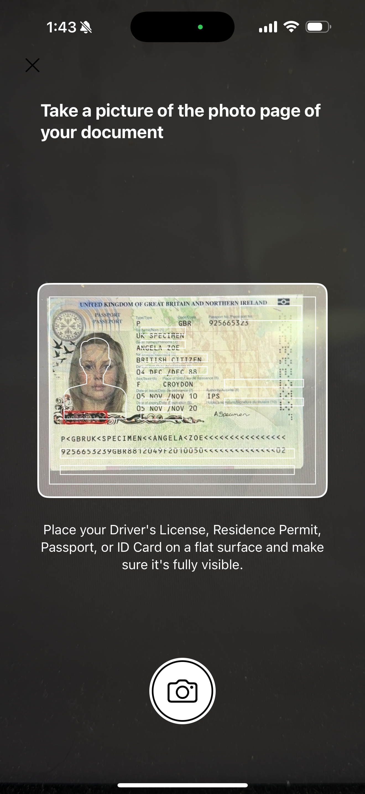
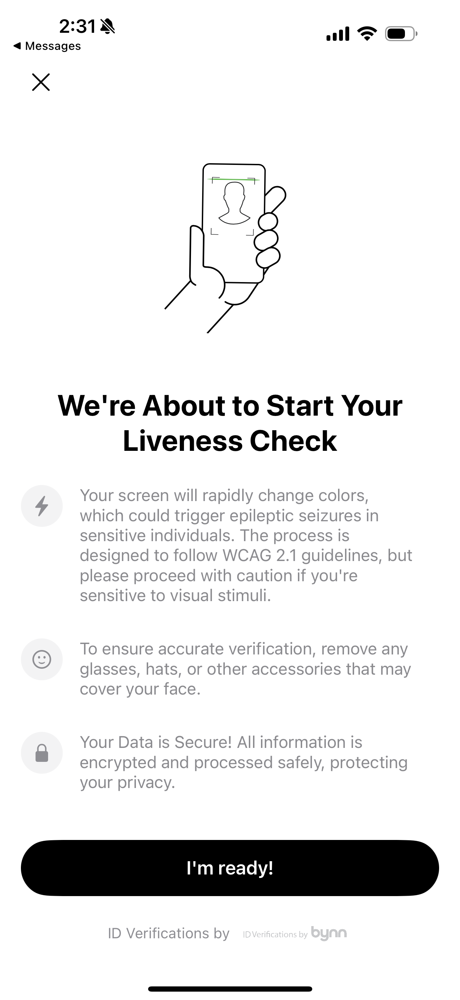
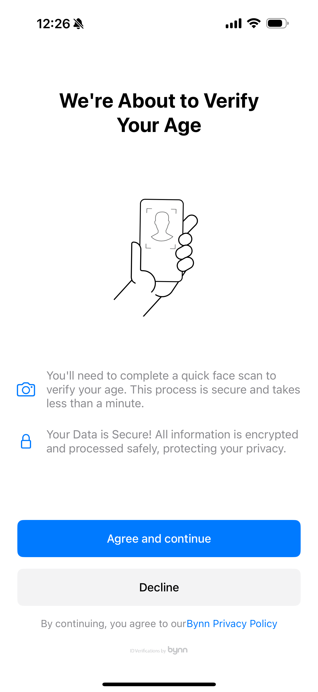

# BynnIDVerification SDK for iOS

## Introduction

BynnIDVerification is a powerful SDK that enables seamless identity verification in your iOS applications. With our easy-to-integrate solution, you can quickly implement secure KYC (Know Your Customer) and age verification processes.



## Requirements

- iOS 14.0+
- Swift 5.5+
- Xcode 13.0+

## Resources

- [API Documentation](https://github.com/Bynn-Intelligence/Bynn-Mobile-SDK-iOS)
- [Demo Application](https://github.com/Bynn-Intelligence/Bynn-Mobile-SDK-iOS)

## Installation

### Swift Package Manager

Add the following URL to your Swift Package dependencies:

```
https://github.com/Bynn-Intelligence/Bynn-Mobile-SDK-iOS.git
```

Or add the dependency to your `Package.swift`:

```swift
dependencies: [
    .package(url: "https://github.com/Bynn-Intelligence/Bynn-Mobile-SDK-iOS.git", from: "1.0.0")
]
```

## Key Features

- **Document Verification**: Capture and verify government-issued IDs
- **Liveness Detection**: Prevent fraud with advanced liveness checks
- **Age Verification**: Specialized flows for age verification requirements
- **Customizable UI**: Adapt the verification flow to match your app's design

## Integration

> **Important**: The `uniqueId` parameter should be a non-PII identifier (like a UUID) that you can use to identify the user in your system. This same identifier will be included in webhook responses to help you match verification results with your users.

### Permissions

Add the following to your `Info.plist`:

```xml
<key>NSCameraUsageDescription</key>
<string>Camera access is required for document and selfie capture during verification</string>
```

### Basic Implementation

```swift
import SwiftUI
import BynnIDVerification

struct ContentView: View {
    @State private var showVerification = false
    
    var body: some View {
        Button("Start Verification") {
            showVerification = true
        }
        .sheet(isPresented: $showVerification) {
            VerificationView()
        }
    }
}

struct VerificationView: View {
    @State private var verificationView: AnyView?
    
    var body: some View {
        VStack {
            if let view = verificationView {
                view
            } else {
                ProgressView("Loading verification flow...")
                    .onAppear {
                        Task {
                            await loadVerificationFlow()
                        }
                    }
            }
        }
    }
    
    func loadVerificationFlow() async {
        let view = await BynnVerification.shared.createVerificationFlow(
            apiKey: "YOUR_API_KEY",
            kycLevel: "ACB123",
            firstName: "John",
            lastName: "Doe",
            uniqueId: "550e8400-e29b-41d4-a716-446655440000", // Non-PII identifier
            phoneNumber: "+1234567890",
            email: "john.doe@example.com",
            ageVerification: false,
            showCompletionView: true,
            onVerificationCompleted: {
                print("Verification completed successfully")
            },
            onVerificationCancelled: {
                print("Verification was cancelled")
            },
            onVerificationError: { errorMessage in
                print("Verification error: \(errorMessage)")
            }
        )
        
        verificationView = view
    }
}
```

## Verification Flow

Our SDK provides a streamlined verification experience for your users:

### 1. Introduction Screen


### 2. Document Scanning


### 3. Liveness Check


## Age Verification

To implement our specialized age verification flow:

```swift
let ageVerificationView = await BynnVerification.shared.createVerificationFlow(
    apiKey: "YOUR_API_KEY",
    kycLevel: "YOUR_KYC_LEVEL_ID",
    uniqueId: "550e8400-e29b-41d4-a716-446655440000", // Non-PII identifier
    ageVerification: true,
    showCompletionView: true
)
```



## Configuration Options

### API Reference

```swift
public func createVerificationFlow(
    apiKey: String,
    kycLevel: String,
    firstName: String?,
    lastName: String?,
    uniqueId: String?,
    phoneNumber: String?,
    email: String?,
    ageVerification: Bool = false,
    showCompletionView: Bool,
    onVerificationCompleted: (() -> Void)? = nil,
    onVerificationCancelled: (() -> Void)? = nil,
    onVerificationError: ((String) -> Void)? = nil
) async -> AnyView
```

### Parameters

| Parameter | Type | Description |
|-----------|------|-------------|
| apiKey | String | Your Bynn API key |
| kycLevel | String | Verification level from your Bynn dashboard (available at https://dashboard.bynn.com/setting/product/kyc) |
| firstName | String? | User's first name |
| lastName | String? | User's last name |
| uniqueId | String? | Unique identifier for the user (non-PII, such as UUID) that will be included in webhooks |
| phoneNumber | String? | User's phone number |
| email | String? | User's email address |
| ageVerification | Bool | Enable specialized age verification flow |
| showCompletionView | Bool | Show completion screen after verification |

## Error Handling

The SDK provides comprehensive error handling through the `onVerificationError` callback:

```swift
onVerificationError: { errorMessage in
    // Handle verification errors
    print("Verification error: \(errorMessage)")
}
```

## Webhooks

BynnIDVerification supports webhooks to notify your backend systems about verification results. Webhooks include the `uniqueId` you provided during verification, allowing you to match results to specific users.

### Configuration

Configure your webhooks in the Bynn Dashboard:
- URL: [https://dashboard.bynn.com/setting/webhook](https://dashboard.bynn.com/setting/webhook)

### Event Types

- `decision.approved`: Triggered when a verification is approved
- `decision.rejected`: Triggered when a verification is rejected
- `decision.challenge`: Triggered when additional verification is required
- `aml.screening.match`: Triggered when there's a match in AML screening

## Versions

| Version | Changes |
|---------|---------|
| 1.0.0   | Initial release |

## Support

For questions or assistance, please contact us at:
- Email: hello@bynn.com
- Website: [https://www.bynn.com](https://www.bynn.com)
